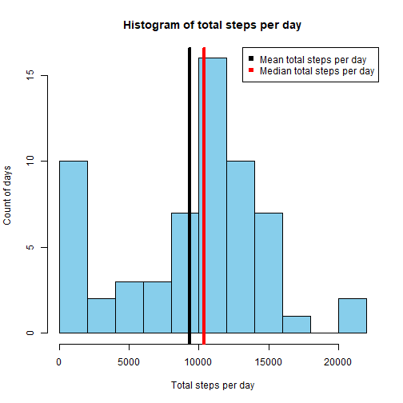
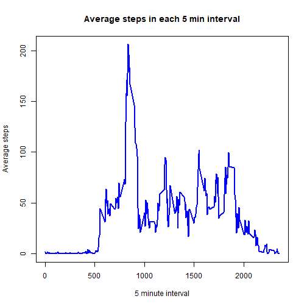
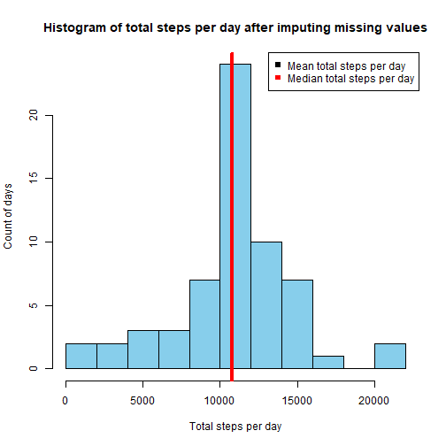
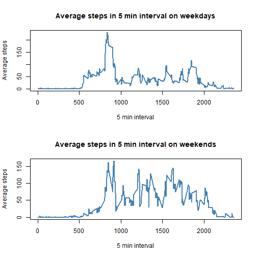

 # Activity Monitoring Data Analysis Report 
 
It is now possible to collect a large amount of data about personal movement using activity monitoring devices such as a Fitbit, Nike Fuelband, or Jawbone Up. These type of devices are part of the “quantified self” movement – a group of enthusiasts who take measurements about themselves regularly to improve their health, to find patterns in their behavior, or because they are tech geeks. 

This document analyzes one such dataset.

<!-- ```{r setoptions, echo = FALSE, results='hide'} -->
<!-- opts_chunk$set(echo = TRUE) -->
<!-- ``` -->

### Load required R packges for analysis

```r
library(dplyr)
```

```
## 
## Attaching package: 'dplyr'
```

```
## The following objects are masked from 'package:stats':
## 
##     filter, lag
```

```
## The following objects are masked from 'package:base':
## 
##     intersect, setdiff, setequal, union
```

```r
library(stringr)
library(lubridate)
```

```
## 
## Attaching package: 'lubridate'
```

```
## The following objects are masked from 'package:base':
## 
##     date, intersect, setdiff, union
```

### Download, unzip and load the activity monitoring data 

```r
fileURL <- "https://d396qusza40orc.cloudfront.net/repdata%2Fdata%2Factivity.zip"
download.file(fileURL,"activityMonitoringData.zip")

currentDir <- getwd()
unzip("activityMonitoringData.zip", exdir = currentDir)

activityData <- read.csv("activity.csv", header = TRUE, sep= ',')
```

Let's take a look at this data set 


```r
str(activityData)
```

```
## 'data.frame':	17568 obs. of  3 variables:
##  $ steps   : int  NA NA NA NA NA NA NA NA NA NA ...
##  $ date    : chr  "2012-10-01" "2012-10-01" "2012-10-01" "2012-10-01" ...
##  $ interval: int  0 5 10 15 20 25 30 35 40 45 ...
```

### What is mean total number of steps taken per day?
convert Date values from characters to dates

```r
activityData$date <- ymd(activityData$date)
```
calculate total number of steps per day 

```r
totalStepsPerDay <- with(activityData, tapply(steps, as.factor(date), sum, na.rm = TRUE))
```
Calculate mean and median value of the total steps per day 

```r
meanTotalStepsPerDay <- mean(totalStepsPerDay)
medianTotalStepsPerDay <- median(totalStepsPerDay)
```
#### Mean total steps per day  - 9354.2295082
#### Median total steps per day - 10395

plot the histogram of the total steps per day 

```r
hist(totalStepsPerDay,breaks =10, col = "skyblue",xlab = 'Total steps per day',
                ylab='Count of days', main = "Histogram of total steps per day")
abline(v= meanTotalStepsPerDay, col='black',lwd = 4) 
abline(v = medianTotalStepsPerDay, col = 'red',lwd =4)
legend("topright",pch = 15,  col = c("black", "red"), 
           legend = c("Mean total steps per day", "Median total steps per day"))
```



### What is the average daily activity pattern?

Calculate average number of steps for each 5 min interval 

```r
activityDataInterval <- as.numeric(levels(as.factor(activityData$interval)))
avgStepsPerInterval <- with(activityData, tapply(steps, as.factor(interval), 
                                                 mean, na.rm = TRUE))
```
plot the graph of 5 min intervals and average steps in each interval 

```r
plot(activityDataInterval, avgStepsPerInterval, xlab = '5 minute interval', 
                               ylab = 'Average steps',
                               main = 'Average steps in each 5 min interval',
                       col = 'blue', type="l", lwd = 2)  
```



```r
maxActivityInterval <- activityDataInterval[avgStepsPerInterval == max(avgStepsPerInterval)]
```
#### 5 min interval which has maximum average steps is 835

### Imputing missing values
calculate the total number of missing values in the data set 

```r
missingValPos <- is.na(activityData$steps)
numMissingVal <- sum(missingValPos)
```
#### Number of missing values in the data set are 2304
Missing values in the data set are replaced by the average value of the steps 
in the interval of missing value

```r
filledActivityData <- activityData %>% group_by(interval) %>% mutate(steps = ifelse(is.na(steps), 
                            mean(steps, na.rm = TRUE), steps))
```
Calculate total number of steps per day for data set imputed missing values 

```r
totalStepsPerDayWoNA <- with(filledActivityData, tapply(steps, as.factor(date), sum, na.rm = TRUE))
```
Calculate mean and median value of the total steps per day 

```r
meanTotalStepsPerDayWoNA <- mean(totalStepsPerDayWoNA)
medianTotalStepsPerDayWoNA <- median(totalStepsPerDayWoNA)
```
#### Mean total steps per day for data set with imputed steps values  - 1.0766189 &times; 10<sup>4</sup>
#### Median total steps per day for data set with imputed steps values- 1.0766189 &times; 10<sup>4</sup>

Plot the histogram of the total steps per day 

```r
hist(totalStepsPerDayWoNA,breaks =10, col = "skyblue",xlab = 'Total steps per day',
     ylab='Count of days', main = "Histogram of total steps per day after imputing missing values")
abline(v= meanTotalStepsPerDayWoNA, col='black',lwd = 4) 
abline(v = medianTotalStepsPerDayWoNA, col = 'red',lwd =4)
legend("topright",pch = 15,  col = c("black", "red"), 
       legend = c("Mean total steps per day", "Median total steps per day"))
```


Calculate the difference between mean and median values of the total steps before and after imputing the
missing values 

```r
diffMeanTotalSteps <- meanTotalStepsPerDayWoNA - meanTotalStepsPerDay
diffMedianTotalSteps <- medianTotalStepsPerDayWoNA - medianTotalStepsPerDay
```
Difference between mean and median steps per day is 1411.959171 and 371.1886792
 
Adding missing values does have an impact on the mean and median steps per day. 
Mean and median value of the total steps per day has increased after imputing missing values. 
Mean and median value of the total steps per day of the data set after imputing are equal

### Are there differences in activity patterns between weekdays and weekends?

Create a new factor variable in the dataset with two levels – “weekday” and 
“weekend” indicating whether a given date is a weekday or weekend day.

```r
filledActivityData <- mutate(filledActivityData, isWeekDay = ifelse(weekdays(date) %in% c("Saturday","Sunday"), "weekend","weekday"))
filledActivityData$isWeekDay <- as.factor(filledActivityData$isWeekDay)
```
Calculate average number of steps for each 5 min interval for data set with imputed values 

```r
avgStepsPerIntervalWoNA <- with(filledActivityData, tapply(steps, list(as.factor(interval),isWeekDay), 
                                                 mean))
```
Plot the Calculate average number of steps for each 5 min interval for data set with imputed values 

```r
par(mfrow = c(2,1))
plot(x = activityDataInterval, y= avgStepsPerIntervalWoNA[,1], type = "l", 
          lwd = '2', col = "steelblue", xlab = "5 min interval", 
          ylab = "Average steps", main = "Average steps in 5 min interval on weekdays")

plot(x = activityDataInterval, y= avgStepsPerIntervalWoNA[,2], type = "l", 
     lwd = '2', col = "steelblue", xlab = "5 min interval", 
     ylab = "Average steps", main = "Average steps in 5 min interval on weekends")
```


